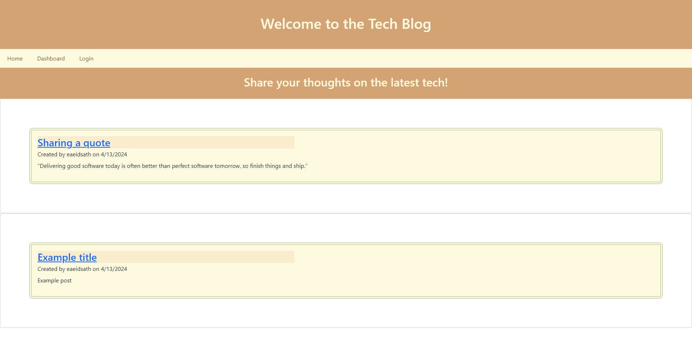
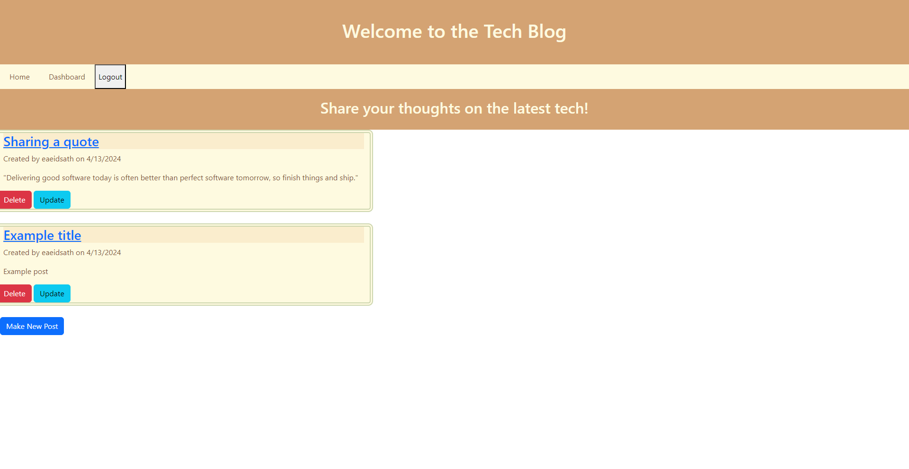

# Tech-Blog

## Description
    
This application is a tech blog where developers can publish their blog posts and comment on other developers’ posts. This site is deployed through Heroku, and can be visited by clicking the link supplied below. Users can create an account, publish their blog posts and comment on other developers’ posts as well.

Tech blogs are important sites for developers to read and share their ideas about technical concepts, recent advancements, and new technologies. Staying up to date with the latest news in the tech world is important for all developers.

Making this tech blog site helped me become very famliar with the Model View Controller (MVC) paradigm and to understand the importance of separation of concerns. This project was my first time building a comprehensive site by handling routes in a controller, defining models, and using Handlebars for the view. I also was able to get practice with user authentication by learning to authenticate application users by verifying their credentials.

## Table of Contents
    
- [Installation](#installation)
- [Usage](#usage)
- [Screenshots](#screenshots)
- [Contributing](#contributing)
- [License](#license)
- [Questions](#questions)
    
## Installation
    
View the deloyed site here [https://infinite-oasis-34090-adbbe6e4db96.herokuapp.com/](https://infinite-oasis-34090-adbbe6e4db96.herokuapp.com/)

To install this application locally, clone this repo to your computer. Navigate to the root directory and run 'npm i' to install the necessary packages. Then run 'npm run start' to start the server locally on port 3001.
    
## Usage

This tech blog is deployed through Heroku and can be viewed here [https://infinite-oasis-34090-adbbe6e4db96.herokuapp.com/](https://infinite-oasis-34090-adbbe6e4db96.herokuapp.com/)

Click the tab names on the navigation menu to see the Home, Dashboard, and login/signup pages. Viewing the dashboard and individual posts require users to be logged in. Users can sign up and log in from the /login page. The home page displays all posts. Click on a post to see it's comments and make your own comments. The dashboard displays all posts made by the user. Here, users can delete and update* their posts. To log out, click the logout button.

*Known issue: update function not working

## Screenshots

    
## Contributing

- Contributors: [eaeidsath](github.com/eaeidsath)
- Credits: 
- Contribution instructions: This project is not seeking contributions at this time.
    
## License

The following license is being used for this project: MIT License.

## Questions

Please direct questions to [eaeidsath](github.com/eaeidsath) or email your questions to evelyneidsath@gmail.com.